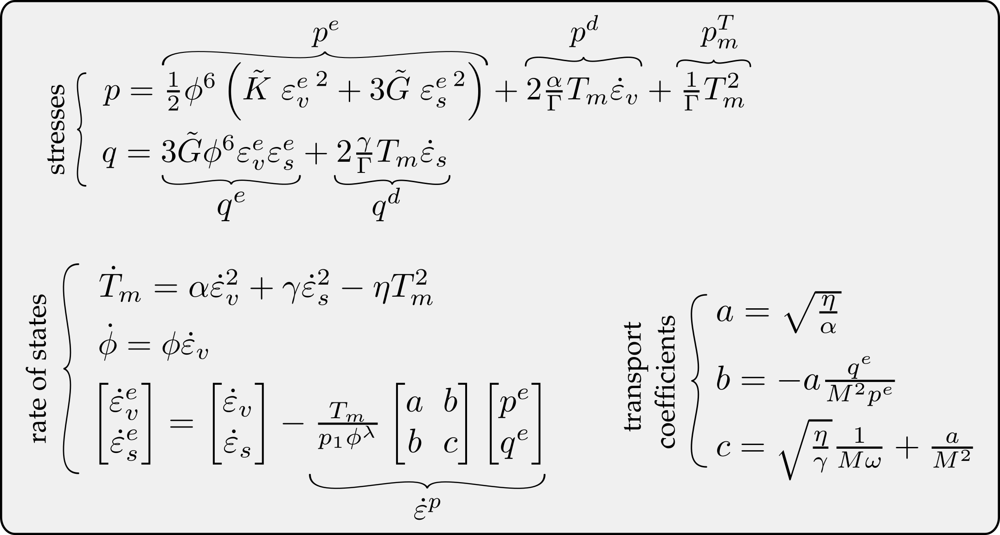

## Terracotta

This library provides an implementation of Terracotta - a simple hydrodynamic model for clay [1].

## The model 

Terracotta is a simple and physically meaningful hydrodynamic constitutive model adept at capturing 
key rheological and mechanical phenomena in clays.
The model is derived using the thermodynamically rigorous hydrodynamic procedure [2] and draws inspiration 
from granular solid hydrodynamics (GSH) [3].
Here, as in the paper [1], the model is formulated in triaxial invariants.
All of the constitutive equations are included in the Figure below.

## Implementation

The complete code is written in Python.
In this implementation, we use the function `scipy.solve_ivp()` [4] to integrate the constitutive equations along a given path.
To this end, the rate formulation of the stresses given in the above Figure has to be derived.
The functions necessary for the model integration are located in `Terracotta_functions.py`.

The loading is defined in terms of the path called `testing`, the loading rate `loadingRates` and the target increment `targetIncs`.
It is possible to run a simulation over multiple paths by including a list of paths in these variables.
Possible loading paths include:

Type of loading | `testing` | `loadingRates` | `targetIncs`
---|---|---|---
triaxial undrained compression | `txu`        | strain rate [1/s]   | strain increment [-]
isotropic compression          | `iso`        | strain rate [1/s]   | strain increment [-]
oedometric compression         | `oed`        | strain rate [1/s]   | strain increment [-]
triaxial drained compression   | `txd`        | strain rate [1/s]   | strain increment [-]
constant pressure shear        | `pureDev`    | strain rate [1/s]   | strain increment [-]
isotropic compression          | `isoStress`  | stress rate [kPa/s] | stress increment [kPa]
relaxation                     | `relaxation` | time step [s]       | time increment [s]
creep                          | `creep`      | time step [s]       | time increment [s]
oedometric creep               | `creepOed`   | time step [s]       | time increment [s]
undrained creep                | `txuCreep`   | time step [s]       | time increment [s]

A sample simulation showing how to define initial conditions and choose a loading path is given in `Terracotta_main.py`.

## References

[1] M Wiebicke and I Einav (2024). "[A Simple Hydrodynamic Model for Clay](http://dx.doi.org/10.2139/ssrn.4699137)". Available at SSRN: [https://ssrn.com/abstract=4699137](https://ssrn.com/abstract=4699137)

[2] L D Landau and E M Lifshitz (1987). Fluid Mechanics. Butterworth. doi:10.1016/C2013-0-03799-1.

[3] Y Jiang, M Liu (2009). Granular solid hydrodynamics. Granular Matter 11, 139–156. doi:10.1007/s10035-009-0137-3

[4] P Virtanen  and SciPy 1.0 Contributors (2020). SciPy 1.0: Fundamental Algorithms for Scientific Computing in Python. Nature Methods, 17(3), 261-272. doi:10.1038/s41592-019-0686-2
